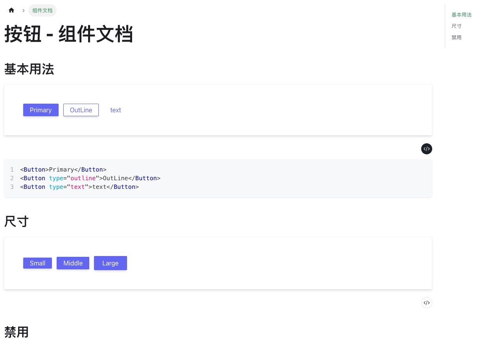
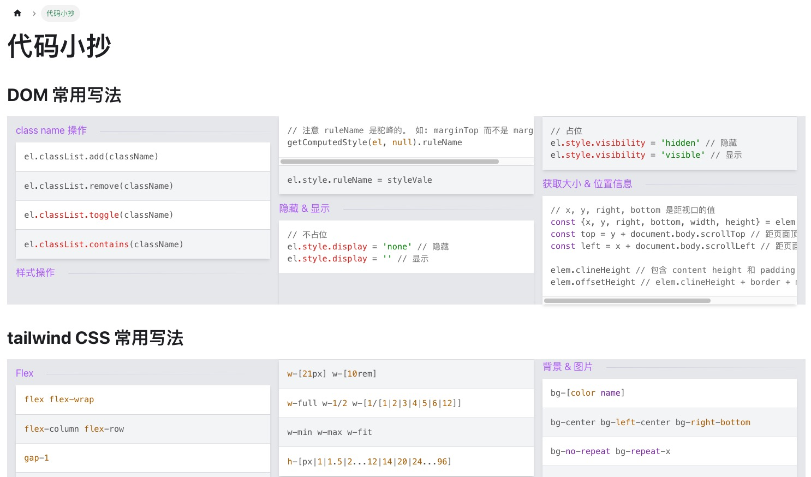
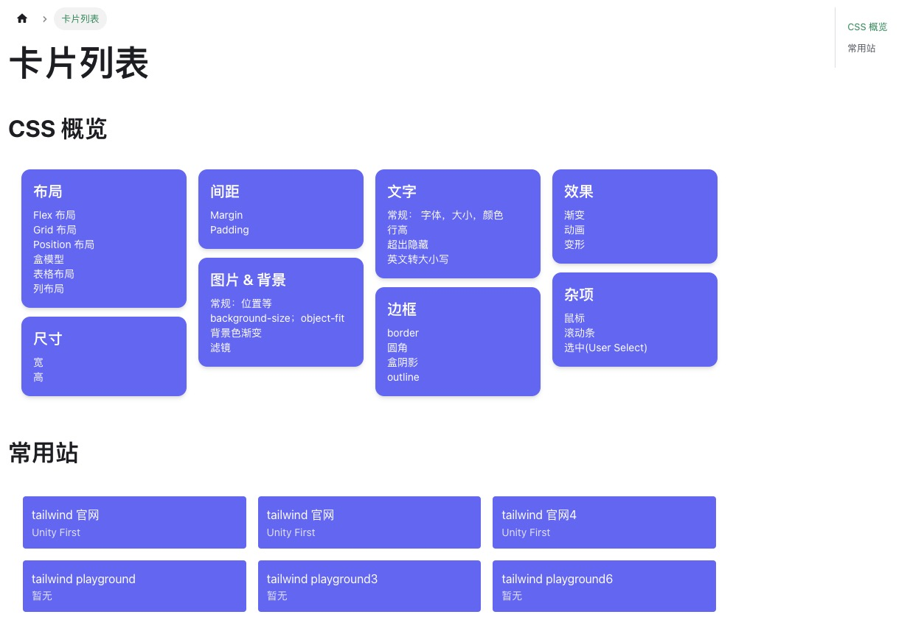

# React 栈 文档网站模板
> 基于 [Docusaurus 2](https://docusaurus.io/)。

## 效果展示







## 已配置内容
* [tailwind 3](https://tailwindcss.com/)。
* [acro.design](https://arco.design/)。
* [lodash](https://lodash.com/)
* 文档内容支持中文搜索。用的搜索插件：[@easyops-cn/docusaurus-search-local](https://github.com/easyops-cn/docusaurus-search-local)
* 支持 Vue3 组件。用的 [Veaury](https://github.com/devilwjp/veaury)。

## 常用脚本
文档位于 `/site` 下。所有脚本都在该目录下执行。

### 安装依赖
```
$ npm install
```

### 启动
```
$ npm start
```

### 部署
```
$ npm build
```
